This project is a full-stack app with real role based authentication, database persistence, and advanced business logic.

The project goes beyond basic CRUD operations by implementing:
-JWT authentication
-role based authorization
-business rules
-dynamic frontend behavior based on user role and state

## 1. Technologies Used

### Backend
-Java 17
  
-Quarkus
  
-Hibernate ORM
  
-PostgreSQL
  
-JWT Authentication

### Frontend
-React
 
-React Router
  
-Fetch API

## 2. Project Features

The system supports two types of users: admins(manage books, borrowers, and borrowings) and users (browse books, borrow and return them, and view their own history).

This project implements real authentication:

-JWT-based authentication
  
-tokens stored in the browser

-role based access using `@RolesAllowed`
  
-backend extracts user identity from JWT (SecurityIdentity)
  
-user role is embedded in the signed JWT

  
  
-All data is stored in PostgreSQL
  
-borrowing, returning, and rating changes are persisted instantly

-Page refresh or application restart does not reset state
  
-Overdue borrowing detection is handled in the backend

-ISBN is generated automatically and preserved on updates

-All actions return success / error feedback based on backend responses

## 3. Business Logic

### Borrower rating system

-starts at 5
  
-late return=>rating decreases by 1

-rating reaches 0=>user can no longer borrow books

### Borrowing flow
User selects borrowing duration (maximum 14 days)
  
-returning a book displays:
  
  -number of late days
    
  -updated borrower rating
    
-all constraints are enforced in the backend, not the frontend

## User features

-View available books (only truly available ones)
-Borrow books with duration selection
-View current borrowings (with overdue status)
-View borrowing history (returned/not returned)
-Pop up feedback for all actions

## Admin Features

-Full book management (add, update, delete)
-Search books by title, author, or genre
-See book availability and who borrowed each book
-Manage borrowers with search functionality
-View overdue borrowings
-View full borrower history in detailed tables

## How to Run the Project

Project needs:  Java 17+, Maven, node.js (v18+) & npm, PostgreSQL (default port 5432), database creation and configuration in application.properties.

Run backend with: mvn quarkus:dev

Backend will run on port 8081

Run frontend: npm run dev

Frontend will run on port 5173

## Screenshots**

### 5.1 LOGIN AND SIGN IN

 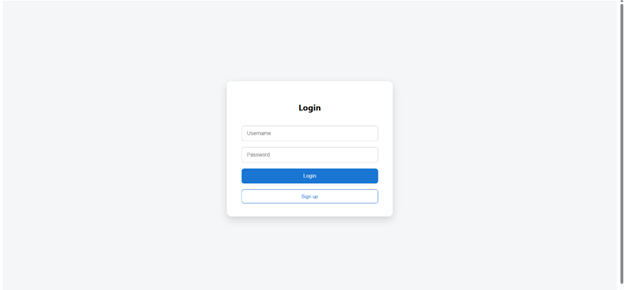
 
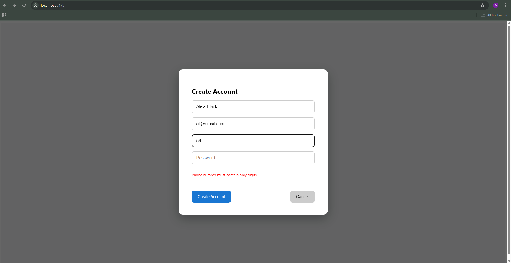

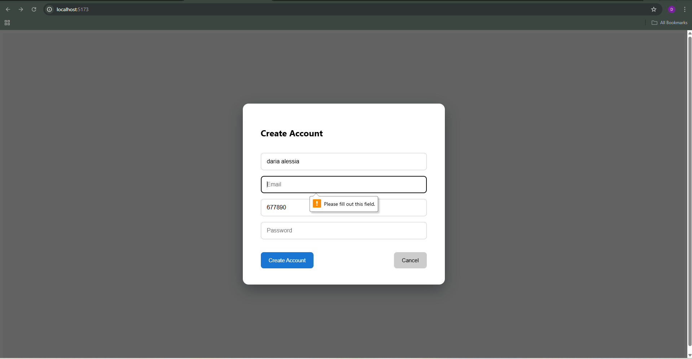

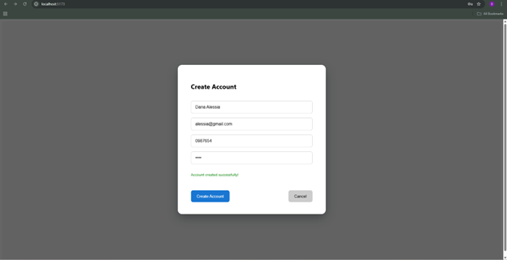

### 5.2 USER

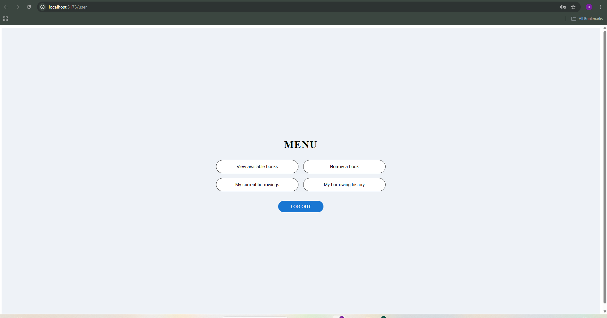

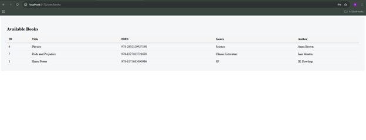

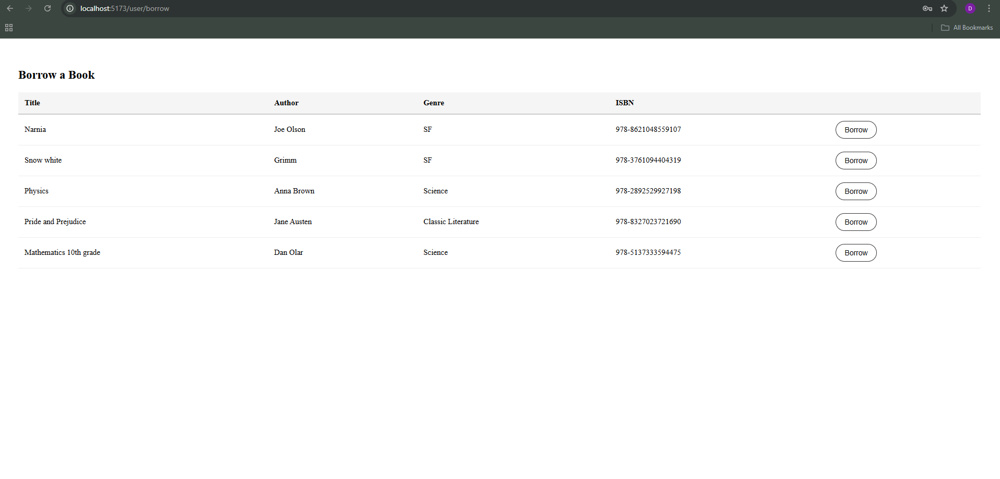

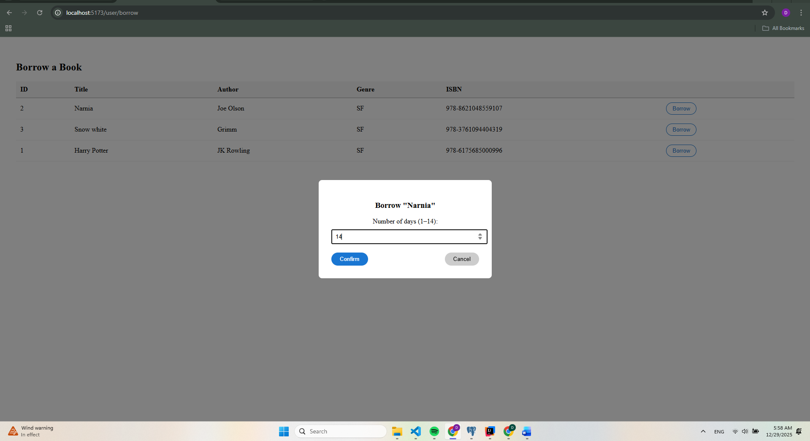

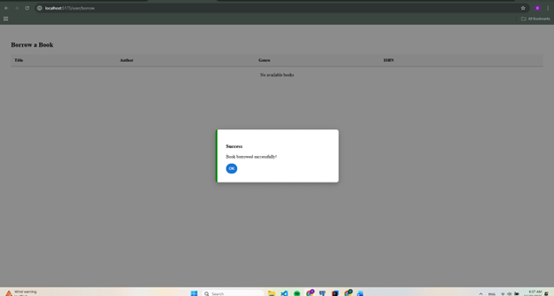

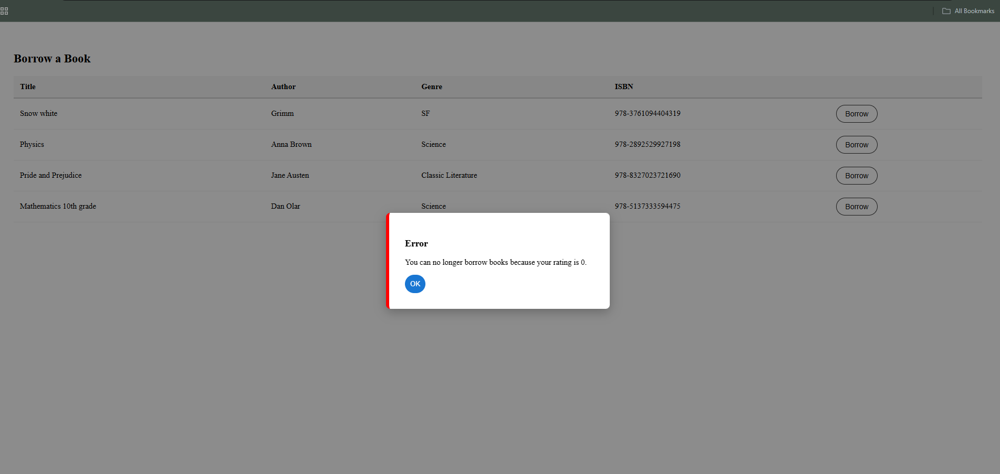

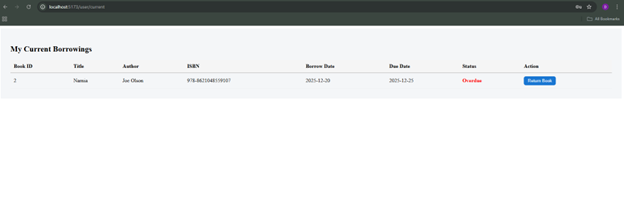

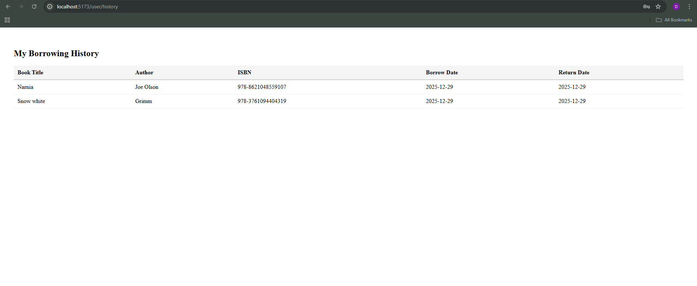

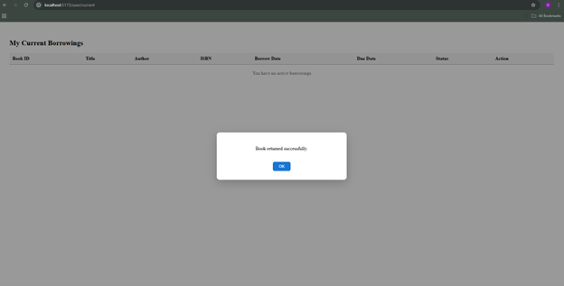

### 5.3 ADMIN

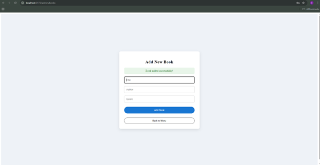

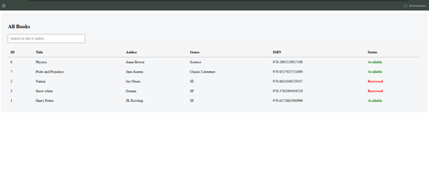

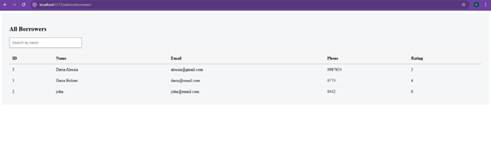

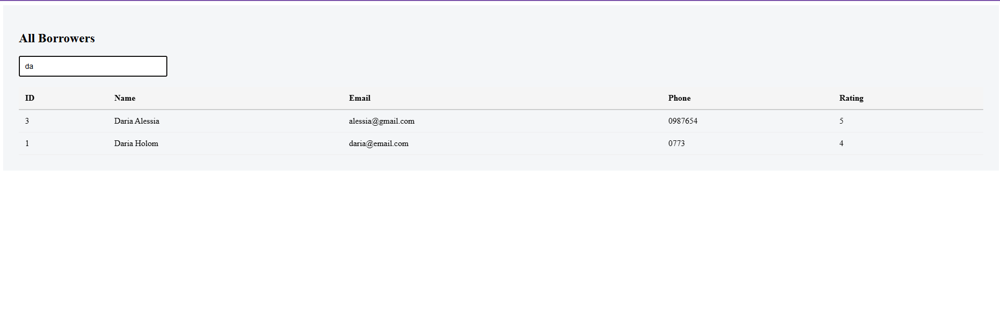

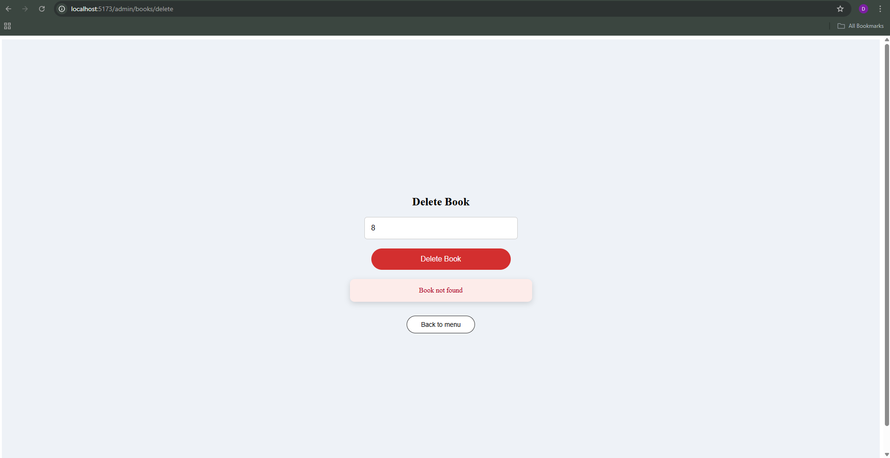

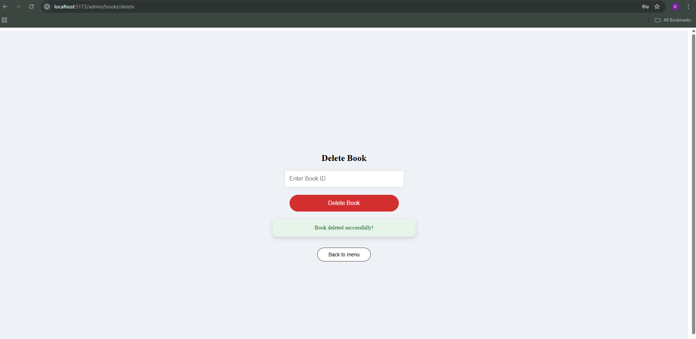

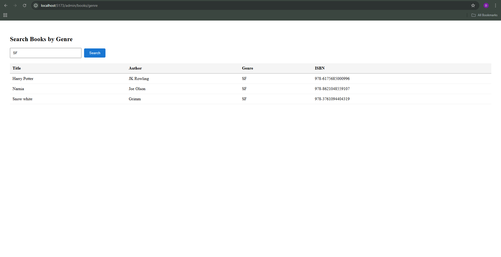

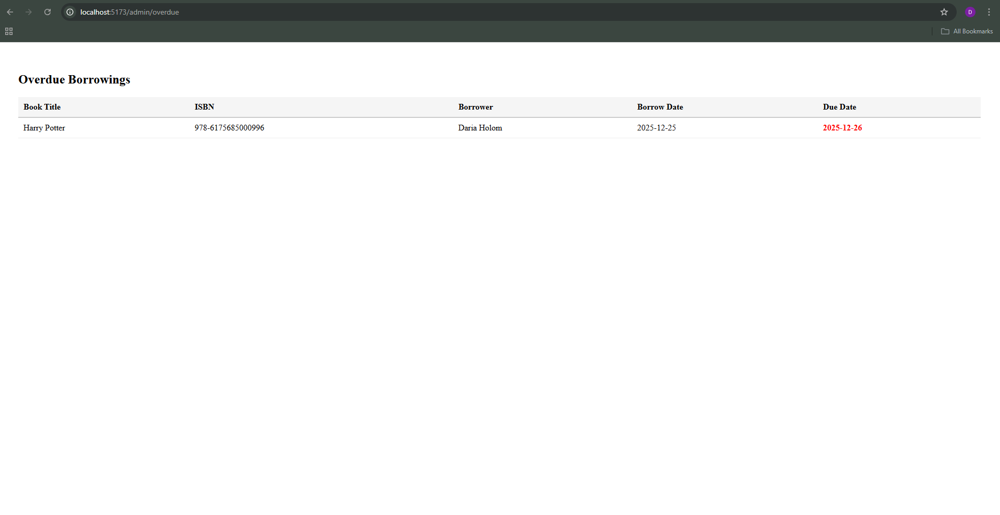

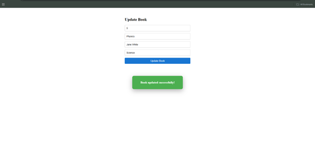

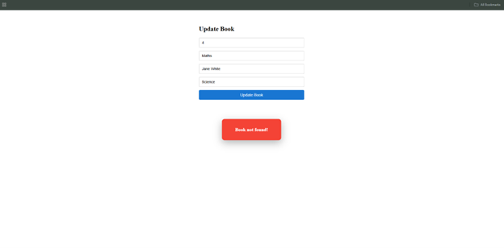

   
